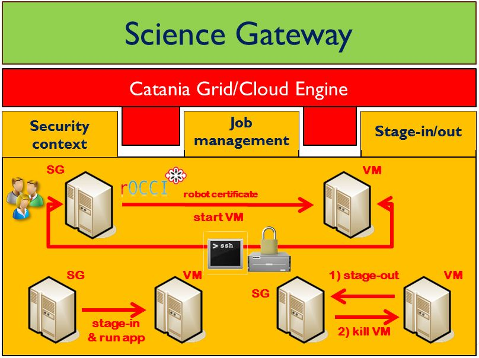

*********************
JSAGA-Adaptor-rOCCI v1.1.0 Docs
*********************

============
About
============

.. image:: images/logo-jsaga.png
   :align: left
   :target: http://software.in2p3.fr/jsaga/latest-release/
-------------

.. _1: https://www.ogf.org
.. _2: http://software.in2p3.fr/jsaga/latest-release/
.. _3: http://occi-wg.org/
.. _CHAIN_REDS: https://www.chain-project.eu/

The Simple API for Grid Applications (SAGA) is a family of related standards specified by the Open Grid Forum [1_] to define an application programming interface (API) for common distributed computing functionality.

These APIs does not strive to replace Globus or similar grid computing middleware systems, and does not target middleware developers, but application developers with no background on grid computing. Such developers typically wish to devote their time to their own goals and minimize the time spent coding infrastructure functionality. The API insulates application developers from middleware.

The specification of services, and the protocols to interact with them, is out of the scope of SAGA. Rather, the API seeks to hide the detail of any service infrastructures that may or may not be used to implement the functionality that the application developer needs. The API aligns, however, with all middleware standards within Open Grid Forum (OGF).

JSAGA [2_] is a Java implementation of the Simple API for Grid Applications (SAGA) specification from the Open Grid Forum (OGF) [1_]. It permits seamless data and execution management between heterogeneous grid infrastructures.

The current stable release is available at:

- http://software.in2p3.fr/jsaga/

The current development SNAPSHOT is available at:

- http://software.in2p3.fr/jsaga/dev/

In the contest of the CHAIN_REDS_ project a new JSAGA adaptor for OCCI-complaint [3_] cloud middleware has been developed to demonstrate the interoperatibility between different open-source cloud providers.

Using the rOCCI implementation of the OCCI standard, the adaptor takes care of: 

(i) switching-on the VM pre-installed with the required application, 
(ii) establishing a secure connection to it signed using a digital “robot” certificate, 
(iii) staging the input file(s) in the VM, 
(iv) executing the application, 
(v) retrieving the output file(s) at the end of the computation and
(vi) killing the VM.

The high-level architecture of the JSAGA adaptor for OCCI-complaint cloud middleware is shown in the below figure:

============
Installation
============
- Import this Java application into your preferred IDE (e.g. Netbeans).

- Configure the application with the needed JSAGA jars files. 

- Configure the src/test/RunTest.java with your settings:

.. code:: java

   // Setting the CHAIN-REDS Contextualisation options
   OCCI_PROXY_PATH = System.getProperty("user.home") + 
                     System.getProperty("file.separator") +
                     "jsaga-adaptor-rocci" +
                     System.getProperty("file.separator") +
                     "x509up_u501";

   // === OCCI SETTINGS for the INFN-STACK CLOUD RESOURCE === //
   OCCI_ENDPOINT_HOST = "rocci://stack-server-01.ct.infn.it";
   OCCI_ENDPOINT_PORT = "8787";
   // Possible OCCI_OS values: 'generic_vm', 'octave' and 'r'
   // f36b8eb8-8247-4b4f-a101-18c7834009e0 ==> generic_vm
   // bb623e1c-e693-4c7d-a90f-4e5bf96b4787 ==> octave
   // 91632086-39ef-4e52-a6d1-0e4f1bf95a7b ==> r        
   // 6ee0e31b-e066-4d39-86fd-059b1de8c52f ==> WRF
        
   OCCI_OS = "f36b8eb8-8247-4b4f-a101-18c7834009e0";
   OCCI_FLAVOR = "small";

   OCCI_VM_TITLE = "rOCCI";
   OCCI_ACTION = "create";

   [..]
   desc.setVectorAttribute(
        JobDescription.FILETRANSFER,
                new String[]{
                        System.getProperty("user.home") + 
                        System.getProperty("file.separator") +
                        "jsaga-adaptor-rocci" +
                        System.getProperty("file.separator") +
                        "job-generic.sh>job-generic.sh",
                        
                        System.getProperty("user.home") + 
                        System.getProperty("file.separator") +
                        "jsaga-adaptor-rocci" +
                        System.getProperty("file.separator") +
                        "output.txt<output.txt",
                        
                        System.getProperty("user.home") + 
                        System.getProperty("file.separator") +
                        "jsaga-adaptor-rocci" +
                        System.getProperty("file.separator") +
                        "error.txt<error.txt"}
   );  

- Create a simple bash script: 

.. code:: bash

 ]$ cat job-generic.sh 
 #!/bin/sh
 sleep 15
 echo "General Info ...> This is a CHAIN-REDS test VM. See below server details "
 echo "-------------------------------------------------------------------------------"
 echo "Running host ...> " `hostname -f`
 echo "IP address .....> " `/sbin/ifconfig | grep "inet addr:" | head -1 | awk '{print $2}' | awk -F':' '{print $2}'`
 echo "Kernel .........> " `uname -r`
 echo "Distribution ...> " `head -n1 /etc/issue`
 echo "Arch ...........> " `uname -a | awk '{print $12}'`
 echo "CPU  ...........> " `cat /proc/cpuinfo | grep -i "model name" | head -1 | awk -F ':' '{print $2}'`
 echo "Memory .........> " `cat /proc/meminfo | grep MemTotal | awk {'print $2'}` KB
 echo "Partitions .....> " `cat /proc/partitions`
 echo "Uptime host ....> " `uptime | sed 's/.*up ([^,]*), .*/1/'`
 echo "Timestamp ......> " `date`
 echo "-------------------------------------------------------------------------------"
 echo "http://www.chain-project.eu/"
 echo "Copyright © 2015"

- Compile the application with your IDE. 

In case of successful compilation you should get the following output message:

.. code:: bash

   init:
   deps-clean:
     Updating property file: /home/larocca/jsaga-adaptor-rocci/build/built-clean.properties
     Deleting directory /home/larocca/jsaga-adaptor-rocci/build
   clean:
   init:
   deps-jar:
     Created dir: /home/larocca/jsaga-adaptor-rocci/build
     Updating property file: /home/larocca/jsaga-adaptor-rocci/build/built-jar.properties
     Created dir: /home/larocca/jsaga-adaptor-rocci/build/classes
     Created dir: /home/larocca/jsaga-adaptor-rocci/build/empty
     Created dir: /home/larocca/jsaga-adaptor-rocci/build/generated-sources/ap-source-output
     Compiling 7 source files to /home/larocca/jsaga-adaptor-rocci/build/classes
     warning: [options] bootstrap class path not set in conjunction with -source 1.6
     1 warning
     Copying 4 files to /home/larocca/jsaga-adaptor-rocci/build/classes
   compile:
     Created dir: /home/larocca/jsaga-adaptor-rocci/dist
     Copying 1 file to /home/larocca/jsaga-adaptor-rocci/build
     Copy libraries to /home/larocca/jsaga-adaptor-rocci/dist/lib.
     Building jar: /home/larocca/jsaga-adaptor-rocci/dist/jsaga-adaptor-rocci.jar
     To run this application from the command line without Ant, try:
     java -jar "/home/larocca/jsaga-adaptor-rocci/dist/jsaga-adaptor-rocci.jar"
   jar:
     BUILD SUCCESSFUL (total time: 10 seconds)

============
Usage
============

- Create a RFC proxy certificate for your given VO:

.. code:: bash

   ]$ voms-proxy-init --voms vo.chain-project.eu -rfc
   Enter GRID pass phrase for this identity:
   Contacting voms.ct.infn.it:15011
   [/C=IT/O=INFN/OU=Host/L=Catania/CN=voms.ct.infn.it] "vo.chain-project.eu".
   Remote VOMS server contacted succesfully.

   Created proxy in /tmp/x509up_u501.
   Your proxy is valid until Wed Jun 03 22:38:16 CEST 2015

- Check if your RFC proxy certificate is valid:

.. code:: bash

 ]$ voms-proxy-info --all
 subject   : /C=IT/O=INFN/OU=Personal Certificate/L=Catania/CN=Giuseppe La Rocca/CN=1660223179
 issuer    : /C=IT/O=INFN/OU=Personal Certificate/L=Catania/CN=Giuseppe La Rocca
 identity  : /C=IT/O=INFN/OU=Personal Certificate/L=Catania/CN=Giuseppe La Rocca
 type      : RFC3820 compliant impersonation proxy
 strength  : 1024
 path      : /tmp/x509up_u501
 timeleft  : 11:59:53
 key usage : Digital Signature, Key Encipherment, Data Encipherment
 === VO vo.chain-project.eu extension information ===
 VO        : vo.chain-project.eu
 subject   : /C=IT/O=INFN/OU=Personal Certificate/L=Catania/CN=Giuseppe La Rocca
 issuer    : /C=IT/O=INFN/OU=Host/L=Catania/CN=voms.ct.infn.it
 attribute : /vo.chain-project.eu/Role=NULL/Capability=NULL
 timeleft  : 11:59:53
 uri       : voms.ct.infn.it:15011

- To test the JSAGA adaptor for OCCI-complaint cloud middleware without Ant, try:

.. code:: bash

 ]$ java -jar "/home/larocca/jsaga-adaptor-rocci/dist/jsaga-adaptor-rocci.jar"

 init:
    Deleting: /home/larocca/jsaga-adaptor-rocci/build/built-jar.properties
        
 deps-jar:
    Updating property file: /home/larocca/jsaga-adaptor-rocci/build/built-jar.properties
    Compiling 1 source file to /home/larocca/jsaga-adaptor-rocci/build/classes
        
 warning: [options] bootstrap class path not set in conjunction with -source 1.6
 1 warning
        
 compile-single:
        
 run-single:

 10:58:02,258 INFO [RunTest:152] 
 Initialize the security context for the rOCCI JSAGA adaptor
 10:58:02,375 Failed to load engine properties, using defaults \
              [./etc/jsaga-config.properties (No such file or directory)]

 10:58:05,165  
 10:58:05,170 Initializing the security context for the rOCCI JSAGA adaptor [ SUCCESS ] 
 10:58:05,173 See below security context details... 
 10:58:05,178 User DN  = /C=IT/O=INFN/OU=Personal Certificate/L=Catania/CN=Giuseppe La Rocca
 10:58:05,179 Proxy    = /home/larocca/jsaga-adaptor-rocci/x509up_u501
 10:58:05,418 Lifetime = 11h.
 10:58:05,622 CA Repos = /etc/grid-security/certificates
 10:58:05,622 Type     = rocci
 10:58:05,930 VO name  = vo.chain-project.eu
 10:58:05,937  
 10:58:05,938 Initialize the JobService context... 
 10:58:05,945 serviceURL = rocci://stack-server-01.ct.infn.it:8787/?prefix=&attributes_title=rOCCI&\
                           mixin_os_tpl=f36b8eb8-8247-4b4f-a101-18c7834009e0&\
                           mixin_resource_tpl=small&\
                           user_data=&\
                           proxy_path=/home/larocca/jsaga-adaptor-rocci/x509up_u501
 10:58:05,958
 10:58:05,958 Trying to connect to the cloud host [ stack-server-01.ct.infn.it ] 
 10:58:05,969
 10:58:05,969 See below the details: 
 10:58:05,970
 10:58:05,970 PREFIX    = 
 10:58:05,971 ACTION    = create
 10:58:05,971 RESOURCE  = compute
 10:58:05,972
 10:58:05,972 AUTH       = x509
 10:58:05,973 PROXY_PATH = /home/larocca/jsaga-adaptor-rocci/x509up_u501
 10:58:05,974 CA_PATH    = /etc/grid-security/certificates
 10:58:05,975  
 10:58:05,975 HOST        = stack-server-01.ct.infn.it
 10:58:05,975 PORT        = 8787
 10:58:05,975 ENDPOINT    = https://stack-server-01.ct.infn.it:8787/
 10:58:05,975 PUBLIC KEY  = /home/larocca/.ssh/id_rsa.pub
 10:58:05,975 PRIVATE KEY = /home/larocca/.ssh/id_rsa
 10:58:05,975
 10:58:05,975 EGI FedCLoud Contextualisation options:
 10:58:05,975 USER DATA  = 
 10:58:05,975 
 10:58:07,485 Creating a new OCCI computeID. Please wait! 
 10:58:07,486 VM Title     = rOCCI
 10:58:07,486 OS           = f36b8eb8-8247-4b4f-a101-18c7834009e0
 10:58:07,486 Flavour      = small
 10:58:07,486
 10:58:07,486 occi --endpoint https://stack-server-01.ct.infn.it:8787/ \
              --action create --resource compute \
              --attribute occi.core.title=rOCCI \
              --mixin os_tpl#f36b8eb8-8247-4b4f-a101-18c7834009e0 \
              --mixin resource_tpl#small \ 
              --auth x509 --user-cred /home/larocca/jsaga-adaptor-rocci/x509up_u501 \
              --voms --ca-path /etc/grid-security/certificates
 
 10:58:13,951 EXIT CODE = 0
 10:58:13,957
 10:58:13,959 A new OCCI computeID has been created:
 10:58:13,961 https://stack-server-01.ct.infn.it:8787/compute/845593b9-2e31-4f6e-9fa0-7386476373f2
 10:58:23,961 
 10:58:23,962 See below the details of the VM 
 10:58:23,962 [ https://stack-server-01.ct.infn.it:8787/compute/845593b9-2e31-4f6e-9fa0-7386476373f2 ]
 10:58:23,962
 10:58:23,963 occi --endpoint https://stack-server-01.ct.infn.it:8787/ \
              --action describe \
              --resource compute \
              --resource https://stack-server-01.ct.infn.it:8787/compute/845593b9-2e31-4f6e-9fa0-7386476373f2 \
              --auth x509 --user-cred /home/larocca/jsaga-adaptor-rocci/x509up_u501 \
              --voms --ca-path /etc/grid-security/certificates \
              --output-format json_extended_pretty
 
 10:58:28,240 EXIT CODE = 0
 10:58:28,241
 10:58:28,241 [
 10:58:28,241 {
 10:58:28,241 "kind": "http://schemas.ogf.org/occi/infrastructure#compute",
 10:58:28,241 "mixins": [
 10:58:28,241 "http://schemas.openstack.org/compute/instance#os_vms",
 10:58:28,242 "http://schemas.openstack.org/template/os#f36b8eb8-8247-4b4f-a101-18c7834009e0"
 10:58:28,242  ],
 10:58:28,242 "actions": [
 10:58:28,242 "http://schemas.ogf.org/occi/infrastructure/compute/action#stop",
 10:58:28,242 "http://schemas.ogf.org/occi/infrastructure/compute/action#suspend",
 10:58:28,242 "http://schemas.ogf.org/occi/infrastructure/compute/action#restart",
 10:58:28,242 "http://schemas.openstack.org/instance/action#create_image",
 10:58:28,242 "http://schemas.openstack.org/instance/action#chg_pwd"
 10:58:28,242  ],
 10:58:28,242 "attributes": {
 10:58:28,242 "occi": {
 10:58:28,242 "core": {
 10:58:28,242 "id": "845593b9-2e31-4f6e-9fa0-7386476373f2"
 10:58:28,242  },
 10:58:28,243 "compute": {
 10:58:28,243 "architecture": "x86",
 10:58:28,243 "cores": "1",
 10:58:28,243 "hostname": "rocci",
 10:58:28,243 "memory": "1.0",
 10:58:28,243 "speed": "0.0",
 10:58:28,243 "state": "active"
 10:58:28,243 }
 10:58:28,243 },
 10:58:28,243 "org": {
 10:58:28,243 "openstack": {
 10:58:28,243 "compute": {
 10:58:28,243 "console": {
 10:58:28,244 "vnc": "http://212.189.145.95:6080/vnc_auto.html?token=7cdfb12e-96d3-4e4c-9881-7fd0fe363110"
 10:58:28,244 },
 10:58:28,244 "state": "active"
 10:58:28,244 }
 10:58:28,244 }
 10:58:28,244 }
 10:58:28,244 },
 10:58:28,244 "id": "845593b9-2e31-4f6e-9fa0-7386476373f2",
 10:58:28,244 "links": [
 10:58:28,244 {
 10:58:28,244 "kind": "http://schemas.ogf.org/occi/infrastructure#networkinterface",
 10:58:28,244 "mixins": [
 10:58:28,244 "http://schemas.ogf.org/occi/infrastructure/networkinterface#ipnetworkinterface"
 10:58:28,244 ],
 10:58:28,245 "attributes": {
 10:58:28,245 "occi": {
 10:58:28,245 "networkinterface": {
 10:58:28,245 "gateway": "0.0.0.0",
 10:58:28,245 "mac": "aa:bb:cc:dd:ee:ff",
 10:58:28,245 "interface": "eth0",
 10:58:28,245 "state": "active",
 10:58:28,245 "allocation": "static",
 10:58:28,245 "address": "90.147.16.130"
 10:58:28,245 },
 10:58:28,245 "core": {
 10:58:28,245 "source": "/compute/845593b9-2e31-4f6e-9fa0-7386476373f2",
 10:58:28,245 "target": "/network/public",
 10:58:28,245 "id": "/network/interface/03fc1144-b136-4876-9682-d1f5647aa281"
 10:58:28,246 }
 10:58:28,246 }
 10:58:28,246 },
 10:58:28,246 "id": "/network/interface/03fc1144-b136-4876-9682-d1f5647aa281",
 10:58:28,246 "rel": "http://schemas.ogf.org/occi/infrastructure#network",
 10:58:28,246 "source": "/compute/845593b9-2e31-4f6e-9fa0-7386476373f2",
 10:58:28,246 "target": "/network/public"
 10:58:28,246 },
 10:58:28,246 {
 10:58:28,246 "kind": "http://schemas.ogf.org/occi/infrastructure#networkinterface",
 10:58:28,246 "mixins": [
 10:58:28,246 "http://schemas.ogf.org/occi/infrastructure/networkinterface#ipnetworkinterface"
 10:58:28,246 ],
 10:58:28,247 "attributes": {
 10:58:28,247 "occi": {
 10:58:28,247 "networkinterface": {
 10:58:28,247 "gateway": "192.168.100.1",
 10:58:28,247 "mac": "fa:16:3e:2f:23:35",
 10:58:28,247 "interface": "eth0",
 10:58:28,247 "state": "active",
 10:58:28,247 "allocation": "static",
 10:58:28,247 "address": "192.168.100.4"
 10:58:28,247 },
 10:58:28,247 "core": {
 10:58:28,247 "source": "/compute/845593b9-2e31-4f6e-9fa0-7386476373f2",
 10:58:28,247 "target": "/network/admin",
 10:58:28,248 "id": "/network/interface/c313ca29-0e86-4162-8994-54dfd45756a2"
 10:58:28,248 }
 10:58:28,248 }
 10:58:28,248 },
 10:58:28,248 "id": "/network/interface/c313ca29-0e86-4162-8994-54dfd45756a2",
 10:58:28,248 "rel": "http://schemas.ogf.org/occi/infrastructure#network",
 10:58:28,248 "source": "/compute/845593b9-2e31-4f6e-9fa0-7386476373f2",
 10:58:28,248 "target": "/network/admin"
 10:58:28,248 }
 10:58:28,248 ]
 10:58:28,248 } 
 10:58:28,248 }
 10:58:28,249  
 10:58:28,249 Starting VM [ 90.147.16.130 ] in progress...
 10:58:28,249  
 10:58:28,249 Waiting the remote VM finishes the boot! Sleeping for a while... 
 10:58:28,249 Wed 2015.06.03 at 10:58:28 AM CEST
 10:59:32,340 [ SUCCESS ] 
 10:59:32,341 Wed 2015.06.03 at 10:59:32 AM CEST
 10:59:36,966  
 10:59:36,966 Job instance created: 
 10:59:36,966 [rocci://stack-server-01.ct.infn.it:8787/?prefix=&\
               attributes_title=rOCCI&\
               mixin_os_tpl=f36b8eb8-8247-4b4f-a101-18c7834009e0&\
               mixin_resource_tpl=small&\
               user_data=&\
               proxy_path=/home/larocca/jsaga-adaptor-rocci/x509up_u501]-\
               [a991707d-3c4b-4a2f-9427-7bf19ded17b5@90.147.16.130#\
               https://stack-server-01.ct.infn.it:8787/compute/845593b9-2e31-4f6e-9fa0-7386476373f2]
 
 10:59:36,967
 10:59:36,967 Closing session...
 10:59:36,967 
 10:59:36,967 Re-initialize the security context for the rOCCI JSAGA adaptor
 10:59:37,005  
 10:59:37,007 Trying to connect to the cloud host [ stack-server-01.ct.infn.it ] 
 10:59:37,010  
 10:59:37,011 See below the details: 
 10:59:37,013  
 10:59:37,013 PREFIX    = 
 10:59:37,013 ACTION    = create
 10:59:37,014 RESOURCE  = compute
 10:59:37,014  
 10:59:37,014 AUTH       = x509
 10:59:37,014 PROXY_PATH = /home/larocca/jsaga-adaptor-rocci/x509up_u501
 10:59:37,014 CA_PATH    = /etc/grid-security/certificates
 10:59:37,015  
 10:59:37,015 HOST        = stack-server-01.ct.infn.it
 10:59:37,015 PORT        = 8787
 10:59:37,015 ENDPOINT    = https://stack-server-01.ct.infn.it:8787/
 10:59:37,016 PUBLIC KEY  = /home/larocca/.ssh/id_rsa.pub
 10:59:37,016 PRIVATE KEY = /home/larocca/.ssh/id_rsa
 10:59:37,016 
 10:59:37,016 EGI FedCLoud Contextualisation options:
 10:59:37,016 USER DATA  = 
 10:59:37,022
 10:59:37,026
 10:59:37,027 Fetching the status of the job 
 10:59:37,028 [ a991707d-3c4b-4a2f-9427-7bf19ded17b5@90.147.16.130#\
               https://stack-server-01.ct.infn.it:8787/compute/845593b9-2e31-4f6e-9fa0-7386476373f2 ] 
 10:59:37,028
 10:59:37,029 JobID [ 
              [rocci://stack-server-01.ct.infn.it:8787/?prefix=&\
              attributes_title=rOCCI&\
              mixin_os_tpl=f36b8eb8-8247-4b4f-a101-18c7834009e0&\
              mixin_resource_tpl=small&\
              user_data=&\
              proxy_path=/home/larocca/jsaga-adaptor-rocci/x509up_u501]-\
              [a991707d-3c4b-4a2f-9427-7bf19ded17b5@90.147.16.130#\
              https://stack-server-01.ct.infn.it:8787/compute/845593b9-2e31-4f6e-9fa0-7386476373f2] 
              ] 
 10:59:37,674
 10:59:37,674 Calling the getStatus() method
 10:59:37,676 Current Status = RUNNING
 10:59:37,676 Execution Host = 90.147.16.130
 10:59:37,677 
 10:59:37,677 Unexpected job status: RUNNING
 10:59:48,204
 10:59:48,204 Calling the getStatus() method
 10:59:48,205 Current Status = RUNNING
 10:59:48,205 Execution Host = 90.147.16.130
 10:59:48,205
 10:59:48,205 Unexpected job status: RUNNING
 10:59:58,680
 10:59:58,681 Calling the getStatus() method
 10:59:58,681 Current Status = DONE
 10:59:58,681 Execution Host = 90.147.16.130
 10:59:58,762 Calling the getExitCode() method
 10:59:58,762
 10:59:58,762 Final Job Status = DONE
 10:59:58,762 Exit Code (0) [ SUCCESS ] 
 10:59:58,762
 10:59:58,762 Retrieving job results.
 10:59:58,762 This operation may take a few minutes to complete...
 11:00:03,973 Calling the getCreated() method
 11:00:04,050 Calling the getStarted() method
 11:00:04,123 Calling the getFinished() method
 11:00:04,214 Calling the getExitCode() method
 11:00:04,217 
 11:00:04,219 Stopping the VM [ 90.147.16.130 ] in progress...
 11:00:04,221 occi --endpoint https://stack-server-01.ct.infn.it:8787/ \
              --action delete \
              --resource compute \
              --resource https://stack-server-01.ct.infn.it:8787/compute/845593b9-2e31-4f6e-9fa0-7386476373f2 \
              --auth x509 \
              --user-cred /home/larocca/jsaga-adaptor-rocci/x509up_u501 \
              --voms \
              --ca-path /etc/grid-security/certificates

 11:00:08,164 EXIT CODE = 0
 11:00:08,165 

 11:00:08,165 Job outputs retrieved [ SUCCESS ] 
 11:00:08,165
 11:00:08,165 Initialize the JobService context [ SUCCESS ] 
 BUILD SUCCESSFUL (total time: 2 minutes 7 seconds)

- Check results:

.. code:: bash

 ]$ cat output.txt 
 General Info ...> This is a CHAIN-REDS test VM. See below server details 
 -----------------------------------------------------------------------------------
 Running host ...> 
 IP address .....>  192.168.100.4
 Kernel .........>  2.6.32-504.3.3.el6.i686
 Distribution ...>  CentOS release 6.6 (Final)
 Arch ...........>  i686
 CPU  ...........>  AMD Opteron 62xx class CPU
 Memory .........>  1030588 KB
 Partitions .....>  major minor #blocks name 253 0 10485760 vda 253 1 204800 vda1 253 2 8182784 vda2
 Uptime host ....>  11:13:48 up 1 min, 0 users, load average: 0.15, 0.06, 0.02
 Timestamp ......>  Wed Jun 3 11:13:48 CEST 2015
 -----------------------------------------------------------------------------------
 http://www.chain-project.eu/
 Copyright © 2015

============
Support
============
Please feel free to contact us any time if you have any questions or comments.

.. _INFN: http://www.ct.infn.it/

:Authors:

 `Roberto BARBERA <mailto:roberto.barbera@ct.infn.it>`_ - Italian National Institute of Nuclear Physics (INFN_),
 
 `Giuseppe LA ROCCA <mailto:giuseppe.larocca@ct.infn.it>`_ - Italian National Institute of Nuclear Physics (INFN_),
 
 `Diego SCARDACI <mailto:diego.scardaci@ct.infn.it>`_ - Italian National Institute of Nuclear Physics (INFN_)
 
:Version: v1.1.0, 2015

:Date: June 3rd, 2015 11:25
